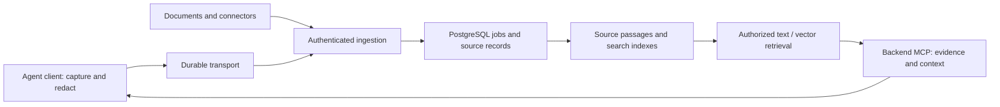

# Vaelius

**Shared memory. Under your control.**

Vaelius is a self-hosted knowledge service for people and AI agents. It captures
explicitly enrolled agent activity, redacts recognizable secrets, preserves
original documents, and retrieves relevant evidence through an authenticated MCP
service. PostgreSQL owns the knowledge, indexes, permissions and processing jobs.

This is an early release tested locally with synthetic scenarios. Production
cloud deployment and real-team acceptance are still work to do.



- **Source-first:** deterministically index redacted original passages. Continuous
  LLM curation, consolidation and reranking are optional operator-configured stages.
- **One authority:** PostgreSQL with full-text search, pgvector/HNSW, indexed access
  checks and tenant routing. Originals live in individual local or S3 source objects.
- **Evidence you can inspect:** timestamps, speaker/actor metadata, source offsets,
  surrounding conversation, original-document discovery and revision provenance.
- **Access and lifecycle:** scoped identity/delegation, user-private preferences,
  revocation, withdrawal and deletion. Permissions are checked again at delivery.
- **Thin client:** capture, deterministic redaction, transport outbox, enrollment,
  hooks and direct backend MCP. The client has no model or searchable corpus.

The current agent integration is Codex. General local document, conversation and
record adapters and a Slack connector are available. Other coding-agent integrations
need their own capture adapters; MCP compatibility alone is not trace capture support.

## Quick start

Requires Python 3.12+, Docker or Podman, and Git. This starts disposable local
PostgreSQL and S3-emulator containers, creates synthetic identities, and makes no
model calls. Keep the state directory outside the repository.

```sh
git clone https://github.com/seankerman/vaelius.git
cd vaelius
python3.12 -m venv .venv
source .venv/bin/activate
python -m pip install build ./packages/client './packages/server[cloud,semantic,cloud-test]'
python scripts/build.py
python -m pip install --no-deps --force-reinstall dist/*.whl
python scripts/dev_services.py start --state "$HOME/.local/share/vaelius/dev"
python scripts/demo.py --state "$HOME/.local/share/vaelius/dev"
python scripts/dev_services.py stop --state "$HOME/.local/share/vaelius/dev"
```

The demo exercises synthetic capture, redaction, actual HTTP ingestion, source
indexing, backend MCP search/evidence delivery and withdrawal. It does not enroll
your existing projects or change your agent configuration.

For a running service, use the profile and API port returned by the setup command:

```sh
python -m agenthub.cloud_runtime --profile /absolute/private/profile --port PORT
vaelius doctor --profile /absolute/private/profile
vaelius worker-run --profile /absolute/private/profile --tenant acme --max-jobs 20 --max-seconds 60
```

See [client enrollment](docs/CLIENT.md), [self-hosting](docs/SELF_HOSTING.md),
[enterprise OAuth and migration](docs/ENTERPRISE_AUTH.md),
[security and data boundaries](docs/DATA_BOUNDARIES.md), and
[model providers](packages/server/docs/MODEL_PROVIDERS.md). The domain vaelius.com
is the project website; it is not an automatically configured hosted API.

## Development

```sh
python scripts/test.py --installed
# Database coverage requires an explicitly disposable manifest:
python scripts/test.py --installed --services /absolute/private/services.json
python scripts/check_public_files.py --artifacts dist
```

Tests use synthetic fixtures. Database tests skipped without a manifest are not
passes. [Release acceptance](docs/RELEASE_ACCEPTANCE.md) records the checks and
remaining gaps for this release. See [CONTRIBUTING.md](CONTRIBUTING.md).

## Repository layout

`packages/client` and `packages/server` are coordinated Python packages in one
repository. The public distributions are `vaelius-client` and `vaelius-server`;
commands are `vaelius-client` and `vaelius`. Existing `agentclient`/`agenthub` Python
namespaces and command aliases remain for compatibility. They use the same service
implementation. Shared synthetic fixtures live under the server tests.

Licensed under [Apache 2.0](LICENSE). [Website](https://vaelius.com).
